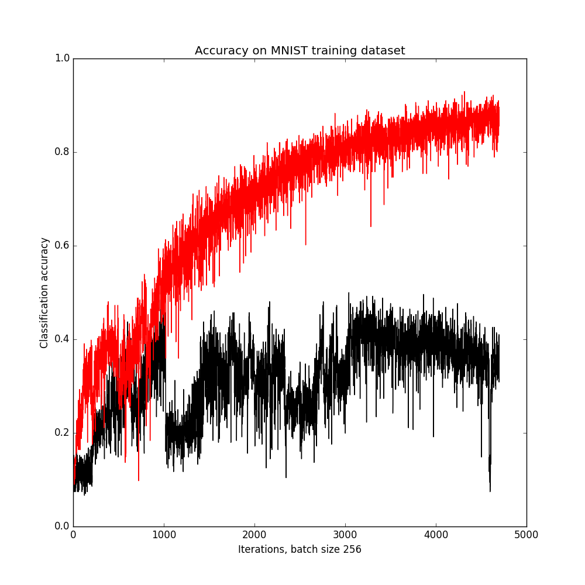
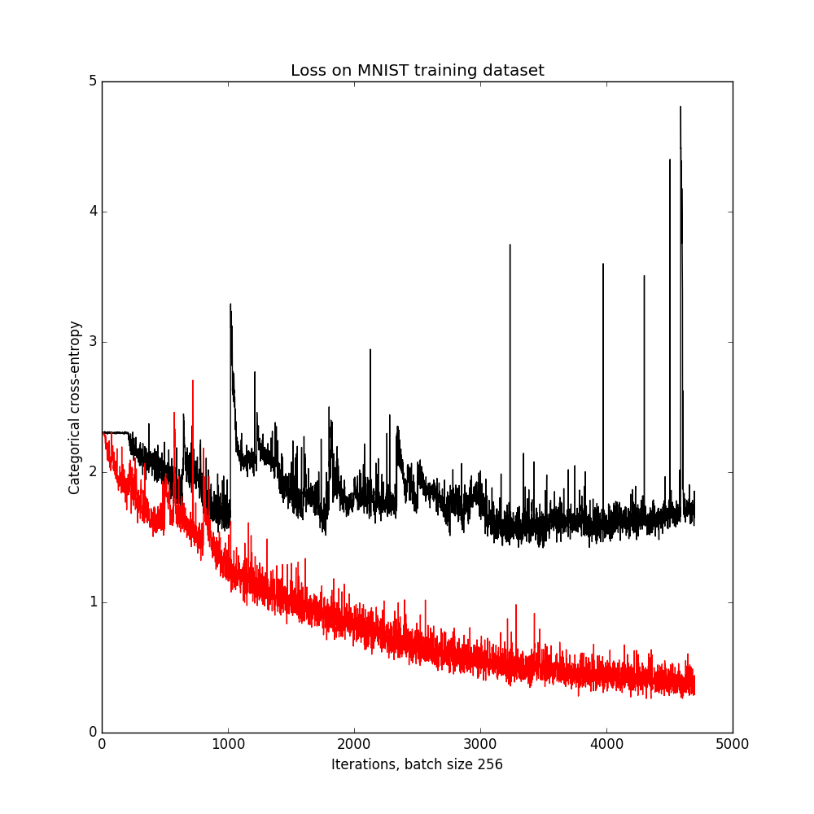

PhasedLSTM-Keras
================

Keras implementation of Phased LSTM [https://arxiv.org/abs/1610.09513], from NIPS 2016.

To install run:
```pip install phased_lstm_keras```

Works both with Theano and Tensorflow backend (tested on Theano 0.9 and Tensorflow 1.0).

Classification performance compared to standard Keras LSTM for MNIST dataset:


   

